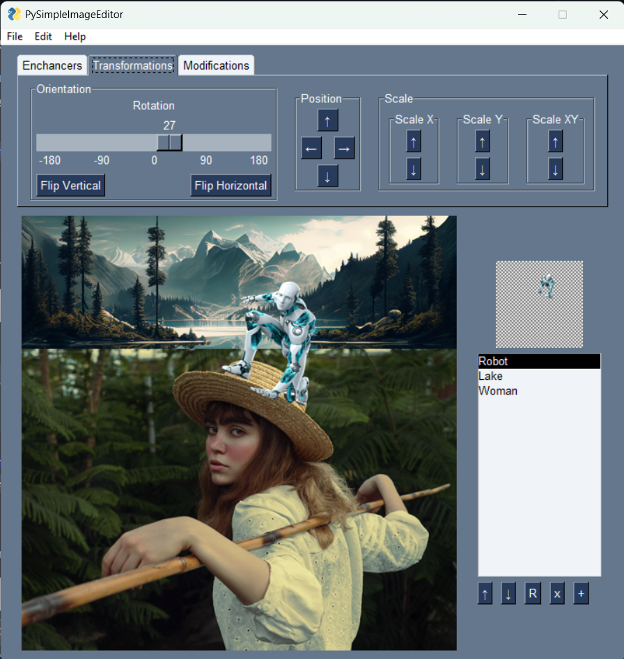
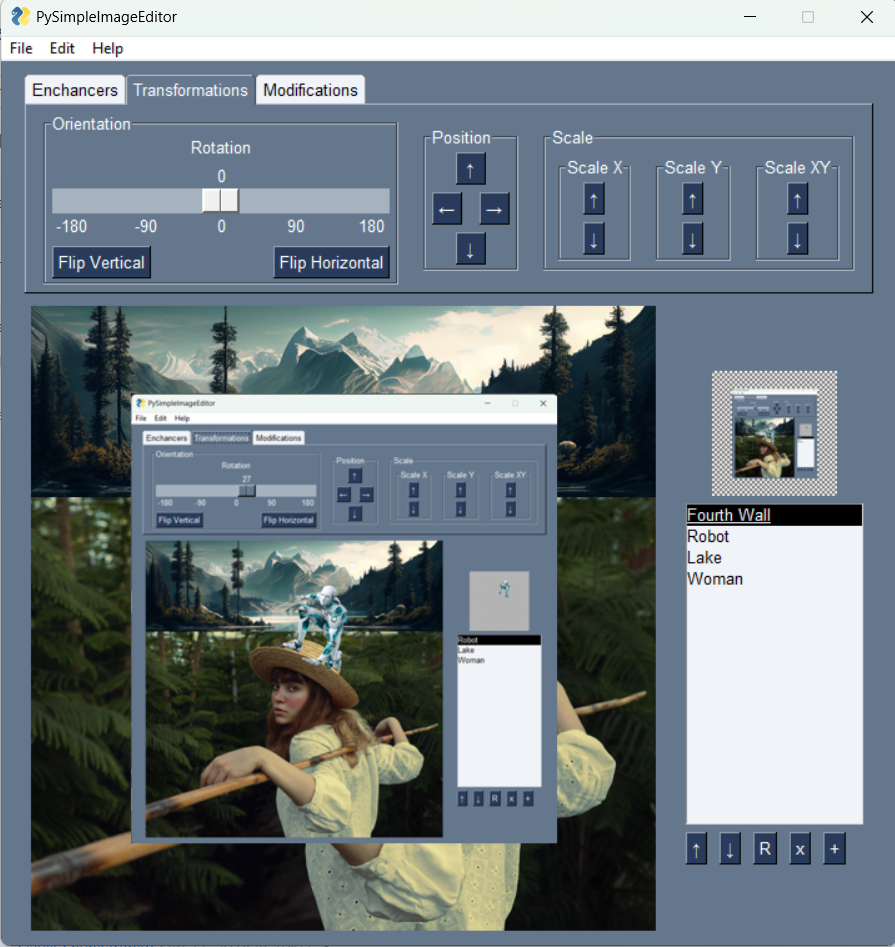
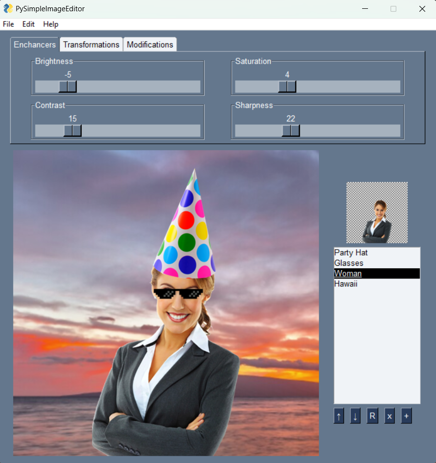

# PySimpleImageEditor

A basic image editor written in python. It has support for layers, so you can edit multiple images at once and create compund images.

### Features

* Тhe usual image enchancers for brightness, saturation, contrast and sharpness
* Arbitrary degrees of rotation for images
* Flips in the vertical and horizontal space
* Supports arbitrary positioning of the layers on the canvas
* Supports scaling on the X, Y and XY axis
* Supports cropping
* Has some basic filters like Grayscale and Negative
* Supports undo and redo on image modifications
* Supports layers by displaying images from top to bottom layer
* Can save images in PNG, JPEG and GIF format
* Can open JPEG, BMP, GIF, PNG, ICO and PPM images
* Image edits are not destructive except the filters

#### Dependencies:

* The program uses PySimpleGUI in order to display the UI
* You need to have tkinter installed as well
* Image modifications are handled by Pillow

Tested on Windows and Linux

#### TODO:

* Add support for arbitrary size for the canvas(it is locked in a 1:1 aspect ratio with a resolution of 500x500)
* Implement a pseudo background remover using the flood fill algorithm
* Add an are you sure you want to leave without saving prompt
* Add keyboard shortcuts
* Unify UI components for Windows, Linux and Mac
* Add more filters like Multiply and Color Dodge

## Instructions on running the application

1. Download the source code/clone the repository
2. Navigate to the project's directory
3. Create a virtual environment using `py -m venv .venv` and activate it (Optional)
4. Install the dependencies using `pip install -r requirements.txt`
5. Run the application using `py main.py`

## Examples

